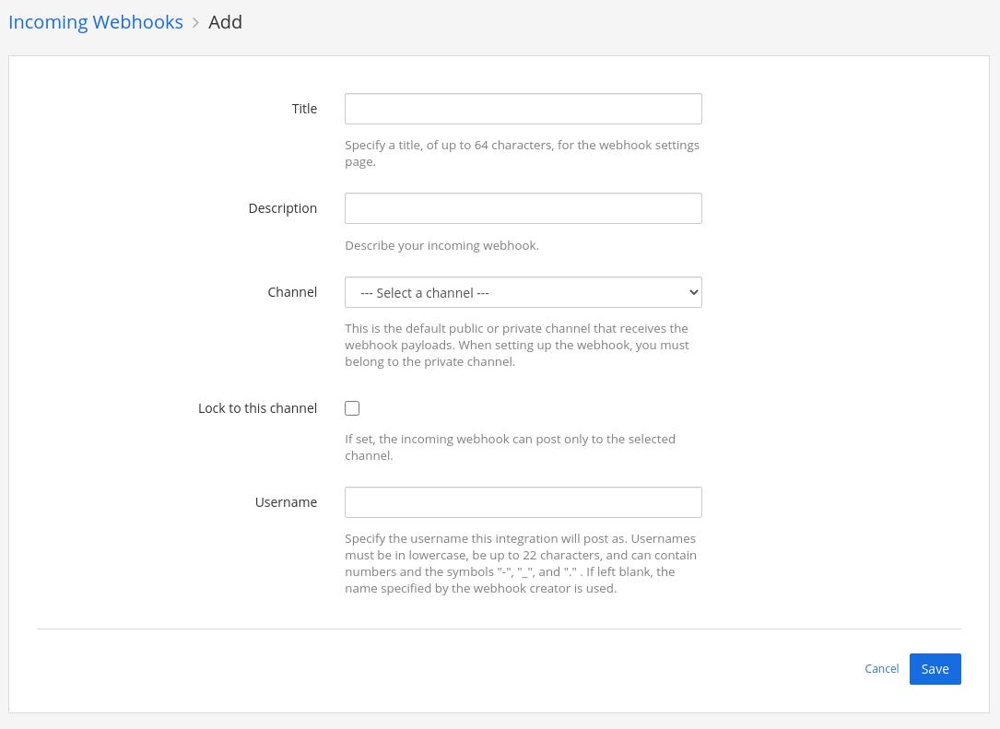
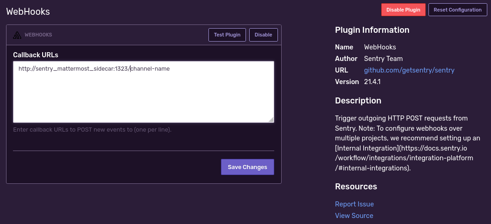

# sentry-mattermost-sidecar

This tools is a sidecar to use sentry webhook on mattermost.

## Roadmap

- [x] Handle sentry Issue alerts
- [ ] Handle sentry Metric alerts

## How to use

First you must create a [Mattermost incoming webhook](https://docs.mattermost.com/developer/webhooks-incoming.html) integration.


Next you must deploy the [docker image](https://hub.docker.com/r/itsalex/sentry-mattermost-sidecar) (don't forget to fill `SMS_MATTERMOST_WEBHOOK_URL` environment variable with the Mattermost webhook URL) somewhere and redirect sentry webhook on it with route name defined as Mattermost channel for each projects.


Then you setup [sentry issue alerts](https://docs.sentry.io/product/alerts/) as you like.


## Getting started

### Requirement

- `docker`
- `go`
- `bash`

## Hack

To start you must launch dev environment:

```sh
$ ./scripts/up.sh
```

This will launch images in [`docker-compose.yml`](./docker-compose.yml).

An image named `workspace` with golang is used as a isolated container to develop. You can use [`enter-workspace.sh`](./scripts/enter-workspace.sh) to enter inside it:

```sh
$ ./scripts/enter-workspace.sh
```

You can build with:

```sh
$ ./scripts/build.sh
```

You can test an example sentry webhook with:

```sh
$ ./scripts/test-request.sh
```

Then you can see the converted request that will be send to mattermost using:

```sh
$ ./scripts/get-last-request-result.sh
```

## Deploy

This image is automatically deployed and versionned as a docker image at [itsalex/sentry-mattermost-sidecar](https://hub.docker.com/r/itsalex/sentry-mattermost-sidecar).

To deploy a new tag use [`./scripts/create-and-push-tag.sh`](scripts/create-and-push-tag.sh):

```sh
$ ./scripts/create-and-push-tag.sh 1.0.0
```